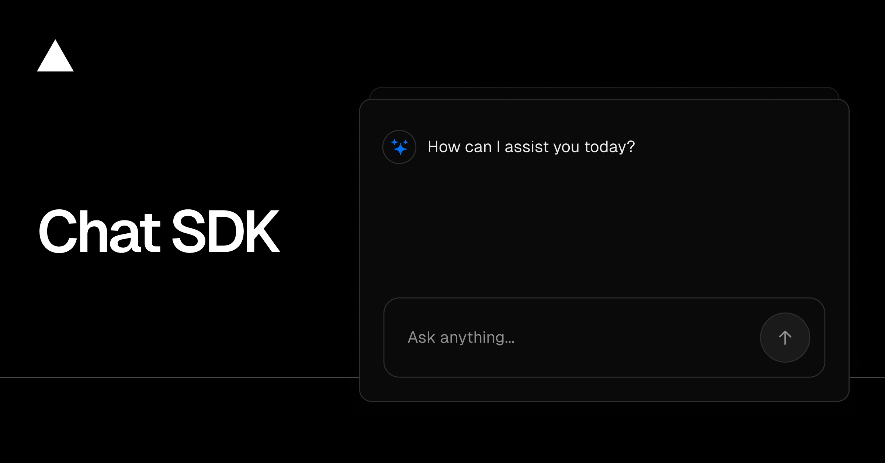

<a href="https://chat.vercel.ai/">
  
  <h1 align="center">Chat SDK</h1>
</a>

<p align="center">
    Chat SDK is a free, open-source template built with Next.js and the AI SDK that helps you quickly build powerful chatbot applications.
</p>

<p align="center">
  <a href="https://chat-sdk.dev"><strong>Read Docs</strong></a> ·
  <a href="#features"><strong>Features</strong></a> ·
  <a href="#model-providers"><strong>Model Providers</strong></a> ·
  <a href="#deploy-your-own"><strong>Deploy Your Own</strong></a> ·
  <a href="#running-locally"><strong>Running locally</strong></a>
</p>
<br/>

## Features

- [Next.js](https://nextjs.org) App Router
  - Advanced routing for seamless navigation and performance
  - React Server Components (RSCs) and Server Actions for server-side rendering and increased performance
- [AI SDK](https://sdk.vercel.ai/docs)
  - Unified API for generating text, structured objects, and tool calls with LLMs
  - Hooks for building dynamic chat and generative user interfaces
  - Supports xAI (default), OpenAI, Fireworks, and other model providers
- [shadcn/ui](https://ui.shadcn.com)
  - Styling with [Tailwind CSS](https://tailwindcss.com)
  - Component primitives from [Radix UI](https://radix-ui.com) for accessibility and flexibility
- Data Persistence
  - [Neon Serverless Postgres](https://vercel.com/marketplace/neon) for saving chat history and user data
  - [Vercel Blob](https://vercel.com/storage/blob) for efficient file storage
- [Auth.js](https://authjs.dev)
  - Simple and secure authentication

## Model Providers

This template ships with [xAI](https://x.ai) `grok-2-1212` as the default chat model. However, with the [AI SDK](https://sdk.vercel.ai/docs), you can switch LLM providers to [OpenAI](https://openai.com), [Anthropic](https://anthropic.com), [Cohere](https://cohere.com/), and [many more](https://sdk.vercel.ai/providers/ai-sdk-providers) with just a few lines of code.

## Deploy Your Own

You can deploy your own version of the Next.js AI Chatbot to Databricks with one click:

[](https://login.staging.cloud.databricks.com/?destination_url=%2Fapps%2Finstall?git_url=https%3A%2F%2Fgithub.com%2Fjerrylian-db%2Fvercel-chatbot&manifest=%7B%22name%22%3A%20%22nextjs-chatbot%22%2C%20%22description%22%3A%20%22A%20chatbot%20build%20with%20next.js%20and%20integrated%20with%20model%20serving%20and%20lakebase.%22%2C%20%22resource_specs%22%3A%20%5B%7B%22name%22%3A%20%22openai-serving-endpoint%22%2C%20%22description%22%3A%20%22The%20OpenAI%20external%20model%20the%20app%20uses%20for%20chat%20completion.%22%2C%20%22serving_endpoint_spec%22%3A%20%7B%22permission%22%3A%20%22CAN_QUERY%22%7D%7D%2C%20%7B%22name%22%3A%20%22chat-history-database%22%2C%20%22description%22%3A%20%22The%20database%20the%20app%20uses%20to%20store%20chat%20history%22%2C%20%22database_spec%22%3A%20%7B%22permission%22%3A%20%22CAN_CONNECT_AND_CREATE%22%7D%7D%5D%7D)

## Running locally

You will need to use the environment variables [defined in `.env.example`](.env.example) to run Next.js AI Chatbot. It's recommended you use [Vercel Environment Variables](https://vercel.com/docs/projects/environment-variables) for this, but a `.env` file is all that is necessary.

> Note: You should not commit your `.env` file or it will expose secrets that will allow others to control access to your various AI and authentication provider accounts.

1. Install Vercel CLI: `npm i -g vercel`
2. Link local instance with Vercel and GitHub accounts (creates `.vercel` directory): `vercel link`
3. Download your environment variables: `vercel env pull`

```bash
pnpm install
pnpm dev
```

Your app template should now be running on [localhost:3000](http://localhost:3000).
